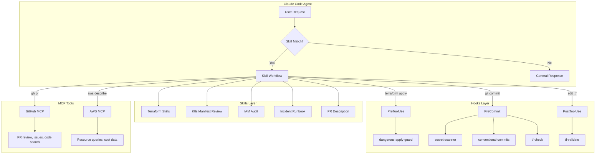

# Architecture

## How skills, hooks, and MCP compose

## Flow

1. **Request arrives** — user asks to deploy, review, or investigate
2. **Skill matches** — agent loads the relevant skill's checklist and workflow
3. **Hooks guard** — before any tool use, hooks validate safety (no prod apply without confirmation, no secrets in commits)
4. **MCP extends** — when the skill needs external data (GitHub PR context, AWS resource state), MCP servers provide it
5. **Output** — structured response following the skill's output format

## Design principles

- **Skills are checklists, not scripts.** They guide judgment, not replace it.
- **Hooks are guardrails, not gates.** They prevent known-bad patterns, not enforce process.
- **MCP is plumbing, not logic.** It provides data access, not decision-making.
